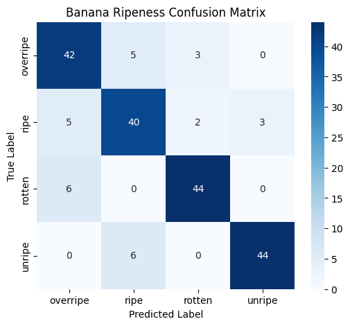

# 🍌 Banana Ripeness & Spoilage Classifier (MobileNetV2)

A Deep Learning computer vision model built with TensorFlow/Keras and MobileNetV2 to classify banana ripeness into 4 discrete stages: **Unripe**, **Ripe**, **Overripe**, and **Rotten**.

---

## 📊 Evaluation & Confusion Matrix



---

## 🛠️ Architecture & Training Highlights

* **Base Model:** Pretrained `MobileNetV2` on ImageNet (Transfer Learning with frozen weights).
* **Classification Head:** Global Average Pooling 2D $\rightarrow$ Dropout (0.3) $\rightarrow$ Softmax Dense (4 classes).
* **Data Augmentation:** Random Horizontal Flip, Random Rotation (0.2), Random Zoom (0.15).
* **Hardware Acceleration:** Trained on Kaggle using NVIDIA T4 x2 GPUs.

---

## 🚀 How to Run Predictions Locally

### 1. Clone the repository & install dependencies
```bash
git clone [https://github.com/kelvinethom-eng/banana-ripeness-classifier.git](https://github.com/kelvinethom-eng/banana-ripeness-classifier.git)
cd banana-ripeness-classifier
pip install -r requirements.txt
```
### stremlit (https://banana-ripeness-classifier-fxcbcjayqersdqrejaagoz.streamlit.app/)
